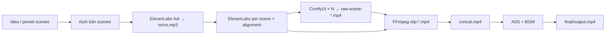

# Ma Chủ — Video Maker

Backend **orchestrator** sinh video dọc (TikTok-style): kịch bản **đa cảnh** (OpenAI, JSON `scenes[]` + `emotion` cho từng cảnh) → ElevenLabs (**một** track **full** `voice.mp3` cho meta / cổng `from-video`, rồi **từng cảnh** + lưu alignment) → **ComfyUI** LivePortrait **một lần mỗi cảnh** (lip-sync theo `scene-*.mp3`, clip lái theo `emotion` **của đúng cảnh đó**) → **FFmpeg**: loop + filter theo cảnh (zoom / pan / shake), concat, đốt ASS, mix BGM. **Tuỳ chọn:** trace **Langfuse** (OpenAI + pipeline + TTS) qua OTEL khi cấu hình khóa trong `.env`.

Không có UI web; gọi **HTTP API** hoặc tích hợp **n8n** (Compose có profile `full`).

**Tài liệu chi tiết (emotion, driving, reuse, artifact, test):** [**docs/pipeline.md**](docs/pipeline.md).

---

## Mục lục nhanh

- [Kiến trúc pipeline](#kiến-trúc-pipeline) · [Yêu cầu](#yêu-cầu) · [Cài đặt](#cài-đặt-nhanh) · [Comfy](#chuẩn-bị-comfyui-tóm-tắt)
- [Biến môi trường](#biến-môi-trường) · [Cấu trúc DATA_ROOT](#cấu-trúc-data_root) · [API](#api-http) · [Scripts](#scripts-npm)
- [Docker](#docker) · [Workflow Comfy](#workflow-api-comfy) · [Tài liệu thêm](#tài-liệu-thêm)

---

## Kiến trúc pipeline



- **`SKIP_COMFY=1`**: bỏ Comfy thật; sinh placeholder **từng cảnh** (`raw-scene-*.mp4`), vẫn OpenAI (nếu có `idea`) + ElevenLabs + FFmpeg như trên. `comfy/raw.mp4` là bản mirror cảnh đầu (tương thích layout cũ).
- **Tái dùng (không gọi lại OpenAI / ElevenLabs)**: sau **một lần** `POST /jobs/render`, dùng `POST /jobs/render/from-video` (mục [API](#api-http)). Cần đủ `audio/*` kèm `scene-*.alignment.json` và `voice.mp3`.

Chi tiết Comfy, model, macOS: [**docs/comfy-macos.md**](docs/comfy-macos.md).

---

## Yêu cầu

| Thành phần | Ghi chú |
|------------|---------|
| **Node.js** | ≥ 20 (theo `package.json` engines) |
| **FFmpeg** | Có `libass` (phụ đề). macOS: `brew install ffmpeg` |
| **OpenAI API** | Sinh kịch bản |
| **ElevenLabs API** | TTS + `with-timestamps` (alignment) |
| **ComfyUI** | Khi `SKIP_COMFY=0`: LivePortrait KJ + Video Helper Suite, xem [docs/comfy-macos.md](docs/comfy-macos.md) |

---

## Cài đặt nhanh

```bash
git clone <repo-url> && cd video-maker
cp .env.example .env
# Điền OPENAI_API_KEY, ELEVENLABS_*, và (nếu dùng Comfy) COMFY_ROOT hoặc COMFY_INPUT_DIR / COMFY_OUTPUT_DIR

npm install
npm run build          # hoặc chỉ dùng tsx cho dev
npm run dev            # http://localhost:3000
```

Tài sản tĩnh tối thiểu (Comfy bật):

- `shared_data/assets/Master_Face.png` — ảnh mặt chính diện.
- `shared_data/assets/driving/*.mp4` — clip lái theo mood (bắt buộc nếu không set `COMFY_DRIVING_VIDEO`); map mặc định: `angry_power`, `laugh_mocking`, `confused_ngo`, `deep_thinking`, `default_arrogant` — xem [docs/pipeline.md §3](docs/pipeline.md#3-emotion--hai-vai-trò-khác-nhau).
- `shared_data/assets/driving_reference.mp4` — **fallback** khi thiếu file trong `driving/` (hoặc dùng làm clip cố định qua `COMFY_DRIVING_VIDEO`).

---

## Chuẩn bị ComfyUI (tóm tắt)

1. Cài ComfyUI native (Python 3.12 khuyến nghị).
2. Chạy:

   ```bash
   export COMFY_ROOT=/đường/dẫn/ComfyUI
   npm run install:comfy-nodes
   ```

3. Bật Comfy: `./venv/bin/python main.py --listen 127.0.0.1 --port 8188`
4. Kiểm tra: `npm run check:comfy`

Toàn bộ bước, patch macOS, lỗi thường gặp: [docs/comfy-macos.md](docs/comfy-macos.md).

---

## Biến môi trường

Bản đầy đủ có comment trong [`.env.example`](.env.example). Bảng rút:

| Biến | Ý nghĩa |
|------|---------|
| `PORT` | Port HTTP API (mặc định 3000) |
| `DATA_ROOT` | Gốc dữ liệu (mặc định `./shared_data`) |
| `OPENAI_API_KEY` / `OPENAI_MODEL` | Kịch bản |
| `OPENAI_BASE_URL` | Tuỳ chọn: proxy/Azure |
| `CHARS_PER_SECOND` | Gợi ý độ dài script |
| `ELEVENLABS_*` | Key, `VOICE_ID`, `MODEL`, `OUTPUT_FORMAT` |
| `COMFY_HTTP_URL` | URL Comfy (vd. `http://127.0.0.1:8188`) |
| `COMFY_WS_URL` | Tuỳ chọn WebSocket |
| `COMFY_ROOT` | Gốc Comfy có `input/` + `output/` — app suy ra input/output nếu chưa set `COMFY_INPUT_DIR` |
| `COMFY_INPUT_DIR` / `COMFY_OUTPUT_DIR` | Ghi đè: nơi Comfy đọc/ghi file (phải trùng server) |
| `COMFY_OOM_MAX_RETRIES` | Số lần retry khi Comfy báo OOM (mặc định `3`) |
| `COMFY_OOM_RETRY_SEC` | Chờ giữa các lần retry OOM, giây (mặc định `30`) |
| `COMFY_WS_TIMEOUT_MS` | Timeout chờ job Comfy qua WebSocket (mặc định `3600000`) |
| `COMFY_DRIVING_VIDEO` | **Ghi đè** toàn pipeline: mọi lần Comfy dùng **một** file mp4 lái cố định (bỏ map theo `emotion`). Nếu **không** set: mỗi cảnh chọn file trong `DATA_ROOT/assets/driving/` theo **`emotion` của cảnh đó** (xem `src/config/driving-videos.ts`). Fallback thiếu file: `DATA_ROOT/assets/driving_reference.mp4` |
| `WORKFLOW_PATH` | Tuỳ chọn: JSON workflow API khác mặc định ([`workflows/workflow_api.json`](workflows/workflow_api.json)) |
| `SKIP_COMFY` | `1` = không gọi Comfy (placeholder video) |
| `BGM_PATH` | Nhạc nền (đối với `DATA_ROOT` hoặc tuyệt đối) |
| `TIKTOK_SAFE_BOTTOM_PCT`, `ASS_*`, `AUDIO_MIX_MODE`, `BGM_*` | Subtitle + mix (xem code / .env.example) |
| `TELEGRAM_*` | Thông báo lỗi Comfy (tuỳ chọn) |
| `PIPELINE_LOG` | `1` = log orchestration chi tiết ra stderr (`src/shared/pipeline-log.ts`) |
| `LOG_LEVEL` | Mức log Pino (mặc định `info`) |
| `LOG_PRETTY` | `1` = stdout dạng đọc được (pino-pretty) |
| `LOG_FILE` | Đường dẫn file NDJSON (append); trong Docker Compose mặc định `/data/logs/app.jsonl` |
| `DEBUG_FFMPEG` | `1` = log lệnh ffmpeg (debug) |
| `FFMPEG_PATH` / `FFPROBE_PATH` | Ghi đè binary FFmpeg / ffprobe nếu không có trong `PATH` |
| `FFMPEG_PRESET` | Preset libx264 khi concat (mặc định `veryfast`) |
| `FFMPEG_CRF` | CRF khi concat (mặc định `20`) |
| `LANGFUSE_PUBLIC_KEY` / `LANGFUSE_SECRET_KEY` | Bật tracing OTEL → Langfuse khi **cả hai** có giá trị |
| `LANGFUSE_TRACING_ENABLED` | `0` = tắt tracing dù đã set key |
| `LANGFUSE_OTEL_EXPORT_MODE` | `immediate` = flush span nhanh (hữu ích khi debug) |
| `LANGFUSE_BASE_URL` | Host Langfuse self-host (thường khớp UI, vd. `http://127.0.0.1:3030`) — xem `.env.example` |
| `LANGFUSE_ELEVENLABS_USD_PER_1K_CHARS` | Ước lượng chi phí TTS trên Langfuse (USD / 1000 ký tự). Alias: `ELEVENLABS_LANGFUSE_USD_PER_1K_CHARS` |
| `LANGFUSE_LOG_TTS_TEXT` | `1` = gửi toàn bộ chuỗi TTS vào trace (mặc định chỉ đếm ký tự) |

**Quan trọng:** File master / voice / driving phải nằm trong **`input` thật** của process Comfy. Nếu không set `COMFY_*` đường dẫn, app thử `../ComfyUI`, `~/SideProject/ComfyUI`, `~/ComfyUI`.

---

## Cấu trúc `DATA_ROOT`

```
shared_data/                    # hoặc DATA_ROOT khi override
  logs/
    app.jsonl                  # tuỳ chọn: khi set LOG_FILE (Docker Compose ghi /data/logs/app.jsonl)
  assets/
    Master_Face.png
    driving_reference.mp4    # fallback khi thiếu file trong driving/
    driving/                 # clip lái theo mood (angry_power, laugh_mocking, …)
  jobs/
    {jobId}/
      meta.json                 # script.scenes[], voice summary, comfy paths
      audio/
        voice.mp3               # giọng full — meta / from-video; Comfy lip-sync dùng scene-*.mp3
        scene-{id}.mp3          # giọng từng cảnh (mux sau ghép)
        scene-{id}.alignment.json  # alignment ElevenLabs (cho ASS + /render/from-video)
      subtitles/burn.ass
      comfy/
        raw.mp4                 # mirror cảnh đầu (tương thích); luồng chính dùng raw-scene-*
        scenes/
          raw-scene-{id}.mp4    # output Comfy từng cảnh (LivePortrait + driving theo emotion cảnh)
          clip-{id}.mp4         # sau loop + filter FFmpeg theo emotion
          concat.mp4            # nối clip trước bước ASS
          concat.txt            # danh sách file cho demuxer FFmpeg
      final/output.mp4          # sản phẩm cuối
```

Trong Docker Compose, `DATA_ROOT` trong container là `/data`, mount `./shared_data:/data`.

---

## API HTTP

| Phương thức | Đường dẫn | Mô tả |
|-------------|-----------|--------|
| `GET` | `/` | Trang HTML gợi ý endpoint |
| `GET` | `/health` | `{ "ok": true, "service": "ma-chu-video-maker" }` |
| `POST` | `/jobs/render` | **Full flow**: OpenAI (nếu có `idea`) **hoặc** `scenes` sẵn → ElevenLabs → Comfy → FFmpeg |
| `POST` | `/jobs/render/from-video` | Chỉ Comfy (tuỳ chọn) + FFmpeg; **tái dùng** `meta` + `audio/*` đã có |

### `POST /jobs/render`

Body JSON (UTF-8). Phải có **`idea`** (gọi OpenAI) **hoặc** **`scenes`** (kịch bản gửi sẵn — **không** gọi OpenAI, tiết kiệm token khi dev Phase 2+).

**A — `idea` (như cũ):**

```json
{
  "jobId": "my-job-001",
  "idea": "Nội dung gợi ý cho kịch bản (tiếng Việt hoặc tuỳ prompt)",
  "bgmPath": "optional/relative/to/DATA_ROOT/music.mp3"
}
```

**B — `scenes` sẵn** (tuỳ chọn kèm `idea` để ghi chú trong `meta`):

```json
{
  "jobId": "phase2-preset-001",
  "idea": "Smoke Phase 2 — preset",
  "scenes": [
    { "id": 1, "text": "Cảnh một thoại ngắn.", "emotion": "laugh" },
    { "id": 2, "text": "Cảnh hai tiếp nối.", "emotion": "thinking" }
  ]
}
```

OpenAI (khi dùng `idea`) trả `scenes[]` cùng schema. Mood: `laugh` | `angry` | `confused` | `thinking` | `default` (mỗi giá trị chọn clip lái Comfy **và** preset FFmpeg cho **đúng cảnh đó`), hoặc legacy: `zoom_in_fast` | `pan_left` | `camera_shake`.

### `POST /jobs/render/from-video`

Dùng khi đã chạy **ít nhất một lần** `/jobs/render` với cùng `jobId` (để có `scene-*.mp3` và `scene-*.alignment.json`).

```json
{
  "jobId": "my-job-001",
  "bgmPath": "optional/relative/to/DATA_ROOT/music.mp3",
  "reuseRawVideo": false
}
```

- **`reuseRawVideo`**: `false` (mặc định) — chạy lại Comfy (hoặc placeholder nếu `SKIP_COMFY=1`): **mỗi cảnh** một job Comfy với `audio/scene-{id}.mp3` và driving theo `meta.script.scenes`, rồi FFmpeg + concat + ASS.
- **`reuseRawVideo`**: `true` — **không** gọi Comfy. Cần đủ `comfy/scenes/raw-scene-{id}.mp4` **hoặc** ít nhất `comfy/raw.mp4` (legacy: một file dùng chung khi thiếu từng `raw-scene-*`). Hữu ích khi chỉ chỉnh FFmpeg / phụ đề.

Lỗi thiếu `scene-*.alignment.json` → `400` (chạy lại full `/jobs/render` một lần trên version hiện tại). Không có `meta.json` → `404`.

### Ví dụ `curl`

```bash
# Full flow (OpenAI)
curl -sS -X POST http://localhost:3000/jobs/render \
  -H 'Content-Type: application/json' \
  -d '{"jobId":"run-001","idea":"Ma Chủ reaction AI roast ngược — hài, hơi bối rối."}'

# Full flow không OpenAI — chỉ TTS + Comfy (Phase 2 tiết kiệm token)
curl -sS -X POST http://localhost:3000/jobs/render \
  -H 'Content-Type: application/json' \
  -d '{"jobId":"preset-001","scenes":[{"id":1,"text":"Câu mở đầu ngắn.","emotion":"laugh"},{"id":2,"text":"Câu kết ngắn.","emotion":"default"}]}'

# Chỉ video (đủ file audio + alignment trong jobs/run-001/)
curl -sS -X POST http://localhost:3000/jobs/render/from-video \
  -H 'Content-Type: application/json' \
  -d '{"jobId":"run-001"}'

# Giữ nguyên raw.mp4, chỉ FFmpeg
curl -sS -X POST http://localhost:3000/jobs/render/from-video \
  -H 'Content-Type: application/json' \
  -d '{"jobId":"run-001","reuseRawVideo":true}'
```

**Phản hồi thành công (200)** (cả hai endpoint):

```json
{
  "ok": true,
  "finalVideoPath": "shared_data/jobs/my-job-001/final/output.mp4",
  "meta": { ... }
}
```

Lỗi validation body → `400`. Lỗi Comfy workflow → `502`. OOM Comfy → `503`. Chi tiết trong JSON `error`.

---

## Scripts npm

| Lệnh | Mô tả |
|------|--------|
| `npm run dev` | `tsx watch src/app.ts` |
| `npm run build` | `tsc` → `dist/` |
| `npm start` | `node dist/src/app.js` |
| `npm run smoke:video` | Kiểm tra FFmpeg + ASS + mux (một luồng), **không** gọi API thật |
| `npm run smoke:multiscene` | **Đa cảnh $0:** sine MP3 + alignment giả / cảnh → `SKIP_COMFY=1` → `final/output.mp4`. Env: `SMOKE_MULTISCENE_N` (12), `SMOKE_MULTISCENE_SCENE_SEC` (5). **JobId mặc định** = `smoke-multiscene-{N}x{SEC}s` (vd. `12x5s`, `3x2s`) để test ngắn không ghi đè bản khác — cố định thư mục: `SMOKE_MULTISCENE_JOB_ID=my-job` |
| `npm run check:comfy` | `GET` Comfy (`COMFY_HTTP_URL`) |
| `npm run verify:driving` | Kiểm tra map emotion → `assets/driving/*.mp4` (không tốn API; cùng logic Comfy) |
| `npm run phase3:preset` | Phase 3: preset **~15s**, [`fixtures/phase3-preset-scenes.json`](fixtures/phase3-preset-scenes.json) (**không OpenAI**). Dài: `PHASE3_FIXTURE=fixtures/phase3-preset-scenes-long.json`. Log: `PIPELINE_LOG=1` |
| `npm run install:comfy-nodes` | Clone LivePortraitKJ + VHS + pip (cần `COMFY_ROOT`) |
| `npm run comfy:render` | **Debug:** một lần Comfy → `comfy/raw.mp4` với `audio/voice.mp3` + driving theo emotion **cảnh đầu** trong `meta` (hoặc `COMFY_TEST_EMOTION`). **Không** sinh `raw-scene-*.mp4` như pipeline chính. `npm run comfy:render -- <jobId>`. Không đặt `SKIP_COMFY=1` |
| `npm run langfuse:seed` | Sinh seed bash cho Docker Langfuse (`scripts/gen-langfuse-seed.sh`) |
| `npm run langfuse:env` | Ghi `.env.langfuse` an toàn từ seed (khuyến nghị thay `> .env.langfuse`) |

**Smoke trả phí tối thiểu (sau khi `smoke:multiscene` xanh):** một lần `POST /jobs/render` với `SKIP_COMFY=1`, `idea` ngắn (2–3 cảnh mong đợi); kiểm tra đủ `scene-*.alignment.json`, rồi `POST /jobs/render/from-video` với `reuseRawVideo: true` để xác nhận tái dùng raw placeholder.

---

## Docker

```bash
docker compose up --build
```

- Service **`app`** expose `3000`, mount `./shared_data` → `/data`. Trong Compose, `DATA_ROOT=/data` và **`LOG_FILE=/data/logs/app.jsonl`** — log NDJSON append (thư mục `logs/` được tạo khi ghi).
- **`redis`** / **`n8n`**: profile `full` — `docker compose --profile full up`.

**Langfuse tự host (tuỳ chọn, tách khỏi stack app):** [`docker-compose.langfuse.yml`](docker-compose.langfuse.yml). Khởi động mẫu: `docker compose -f docker-compose.langfuse.yml --env-file .env.langfuse up -d`. Sinh `.env.langfuse`: `npm run langfuse:env` (hoặc `npm run langfuse:seed`). Copy `LANGFUSE_INIT_PROJECT_PUBLIC_KEY` / `SECRET_KEY` vào `.env` của app làm `LANGFUSE_PUBLIC_KEY` / `LANGFUSE_SECRET_KEY` — xem comment trong [`.env.example`](.env.example).

ComfyUI **không** nằm trong image app; chạy host riêng và trỏ `.env` tới đó (hoặc mạng Docker nếu bạn tự thêm service Comfy).

---

## Workflow API Comfy

File mặc định: [`workflows/workflow_api.json`](workflows/workflow_api.json). Id node khớp [`src/config/comfy-workflow.ts`](src/config/comfy-workflow.ts). Đổi graph: Export API từ Comfy rồi cập nhật hai file này.

---

## Tài liệu thêm

| File | Nội dung |
|------|----------|
| [docs/pipeline.md](docs/pipeline.md) | **Chi tiết:** bảng bước pipeline, `emotion` (Comfy hook vs FFmpeg từng cảnh), map `assets/driving/`, alignment, `/from-video`, `verify:driving`, E2E |
| [docs/dev-phases.md](docs/dev-phases.md) | Phase dev + Definition of done + kế hoạch test T0–T4 (ưu tiên $0 với `smoke:multiscene`) |
| [docs/README.md](docs/README.md) | Mục lục thư mục `docs/` |
| [docs/comfy-macos.md](docs/comfy-macos.md) | ComfyUI + LivePortrait + macOS + symlink / `COMFY_*` + lỗi thường gặp |
| [docker-compose.langfuse.yml](docker-compose.langfuse.yml) | Stack Langfuse self-host (OTEL / trace UI) — dùng cùng khóa dự án trong `.env` app |
| [.env.langfuse.example](.env.langfuse.example) | Mẫu env cho stack Langfuse; khuyến nghị `npm run langfuse:env` thay vì chỉnh tay |
| [.env.example](.env.example) | Mẫu biến môi trường có comment |

---

## License / ghi chú sản phẩm

- ElevenLabs, OpenAI: tuỳ điều khoản tài khoản.
- LivePortrait / custom nodes: xem license từng repo (InsightFace có bản **non-commercial** nếu dùng nhánh đó; repo hiện dùng **FaceAlignment / blazeface** theo [`docs/comfy-macos.md`](docs/comfy-macos.md)).
