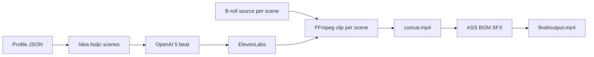

# Điện ảnh hóa kiến thức — Video Maker

Backend orchestrator: video dọc **voiceover + B-roll**. Luồng: **preset JSON** (`DATA_ROOT/profiles/`) → OpenAI (optional, **đúng 5 cảnh** Hook / 3 facts / CTA) hoặc `scenes` gửi sẵn → **ElevenLabs** (full + per-scene + alignment) → copy **MP4 B-roll** vào job → **FFmpeg** (`freeze_last` hoặc `loop`, motion nhẹ) → concat → **ASS** (màu/font từ preset, từ khóa nhấn) + **BGM** + **SFX** (tuỳ file trong preset).

**Admin (tuỳ chọn):** đặt `ADMIN_API_TOKEN` trong `.env`, chạy `npm run build` (gồm `admin:build`), rồi `npm start` — UI tại **`/admin/`** (quản lý job, profiles, **POST** render/from-video). Dev: hai terminal **`npm run dev`** và **`npm run admin`**. Còn không thì chỉ **HTTP API** hoặc **n8n** (Compose profile `full`). **GET `/health`** — kiểm tra service sống.

**Preset-first:** màu chữ, font, BGM/SFX, motion mặc định và gợi ý OpenAI/ElevenLabs nằm trong `DATA_ROOT/profiles/{profileId}.json`. Secrets và override máy-local trong `.env`; body API chỉ cần `profileId` + object `tuning` mỏng khi lệch so với file.

Chi tiết merge, artifact và E2E: [**docs/pipeline.md**](docs/pipeline.md) · mục lục docs: [**docs/README.md**](docs/README.md).

---

## Kiến trúc pipeline



---

## Yêu cầu

| Thành phần | Ghi chú |
|------------|---------|
| **Node.js** | ≥ 20 |
| **FFmpeg** | Có `libass` |
| **OpenAI API** | Khi dùng `idea` |
| **ElevenLabs API** | TTS + `with-timestamps` |

---

## Cài đặt nhanh

```bash
cp .env.example .env
# Điền OPENAI_API_KEY, ELEVENLABS_* ; RENDER_PROFILE_ID trỏ tới file trong shared_data/profiles/

npm install
npm run build
npm run dev
```

- **Preset mặc định:** [`shared_data/profiles/cinematic_mystery.json`](shared_data/profiles/cinematic_mystery.json).
- **Placeholder B-roll:** `assets/broll/placeholder.mp4` — tự tạo (nền đen) nếu thiếu khi render.
- **SFX:** map trong preset → file dưới `assets/sfx/`; nếu thiếu, pipeline tạo sóng sine ngắn để smoke không vỡ.

---

## DATA_ROOT

```
shared_data/
  profiles/
    cinematic_mystery.json
  assets/
    broll/placeholder.mp4
    sfx/...
  jobs/{jobId}/
    meta.json                 # effectiveRenderConfig, scenes, …
    audio/voice.mp3, scene-*.mp3, scene-*.alignment.json
    media/scenes/
      source-{id}.mp4         # B-roll đã ingest
      clip-{id}.mp4
      concat.mp4
    subtitles/burn.ass
    final/output.mp4
```

---

## API

| Phương thức | Đường dẫn | Body / gợi ý |
|-------------|-----------|----------------|
| `GET` | `/health` | JSON `ok` + `service` |
| `POST` | `/jobs/render` | `{ "jobId", "idea" }` hoặc `{ "jobId", "scenes": [{ "id", "text", "motion", ... }], "profileId?", "tuning?", "bgmPath?" }` |
| `POST` | `/jobs/render/from-video` | `{ "jobId", "reuseRawVideo?", "assembleOnly?", "profileId?", "tuning?", "bgmPath?" }` |

Mỗi scene: **`text`**, **`motion`** (`static` \| `zoom_mild` \| `zoom_in_fast` \| `laugh_zoom` \| `pan_left` \| `camera_shake`), tuỳ chọn `videoPath` (rel `DATA_ROOT`), `emphasisWords`, `videoMode`, `sfxKey`.

**Response** (200): `{ "ok": true, "finalVideoPath": "/.../final/output.mp4", "meta": { ... } }`. Lỗi validation: 400 + `error` (Zod); lỗi pipeline: 500 hoặc 404 (`Job meta not found` → 404 trên `from-video`).

OpenAI với `idea` luôn trả **5 scenes** id 1…5 (Hook, 3 facts, CTA).

**Tuning:** merge: **`.env` + default code** (cùng lớp trong `defaultEffective`) → **file preset** → **`tuning`** trên API → **override từng scene** (`motion`, `videoMode`, …). Chi tiết [docs/pipeline.md — §2.1](docs/pipeline.md#21-knob-env-preset-tuning-scene).

---

## Scripts npm

| Lệnh | Mô tả |
|------|--------|
| `npm run dev` | API dev |
| `npm test` | Unit (Zod + merge); không gồm E2E |
| `npm run test:e2e` | E2E HTTP — xem mục dưới (cần `ffmpeg` / `ffprobe`) |
| `npm run smoke:video` | ASS + mux một track |
| `npm run smoke:multiscene` | Đa cảnh, không ElevenLabs |
| `npm run phase3:preset` | Preset từ `fixtures/phase3-preset-scenes.json` |
| `npm run render:consistency` | Hai scene qua HTTP (cần server + ElevenLabs) |
| `npm run render:from-video` | CLI gọi phase video (cần job đã có meta + audio + alignment) |
| `npm run smoke:chain` | Smoke FFmpeg: trích frame cuối từ MP4 tổng hợp |
| `npm run langfuse:env` | Sinh secrets vào `.env.langfuse` (Compose Langfuse) |
| `npm run langfuse:seed` | Seed biến khởi tạo Langfuse (đọc `scripts/gen-langfuse-seed.sh`) |

### Test E2E (`npm run test:e2e`)

- **Không phí API:** suite `POST /jobs/render/from-video` seed job cục bộ (sóng sinh + alignment) rồi gọi HTTP. Mặc định spawn app trong thư mục `DATA_ROOT` tạm; cần `ffmpeg` trên `PATH`.
- **CI:** nếu `CI` được set mà không có `E2E_HTTP=1`, suite from-video **bỏ qua** (chỉ chạy unit trong `npm test`). Trên CI muốn chạy E2E: bật `E2E_HTTP=1` và cài `ffmpeg`.
- **Gắn server sẵn:** `E2E_BASE_URL=http://127.0.0.1:3000` và **`E2E_DATA_ROOT` hoặc `DATA_ROOT`** trùng với server → test chỉ seed job + `fetch` (server bạn tự `npm run dev`).
- **Cổng spawn:** `E2E_PORT` (mặc định nội bộ chọn cổng ngẫu nhiên an toàn nếu không set).
- **Có phí (tùy chọn):** với `ELEVENLABS_API_KEY` + `ELEVENLABS_VOICE_ID`, suite `POST /jobs/render` một cảnh ngắn sẽ chạy; không set → suite đó **skip**. Nên tắt trace: `LANGFUSE_TRACING_ENABLED=0`.

---

## Docker

```bash
docker compose up --build
```

Compose chạy orchestrator (và profile `full`: Redis + n8n); không bật GPU hay node render bên thứ ba trong file này.

---

## Tài liệu

| File | Nội dung |
|------|----------|
| [docs/README.md](docs/README.md) | Mục lục tài liệu trong repo |
| [docs/pipeline.md](docs/pipeline.md) | Luồng render, preset, merge knob, `from-video`, E2E |
| [.env.example](.env.example) | Biến môi trường ứng dụng |
| [.env.langfuse.example](.env.langfuse.example) | Biến mẫu cho `docker-compose.langfuse.yml` |
